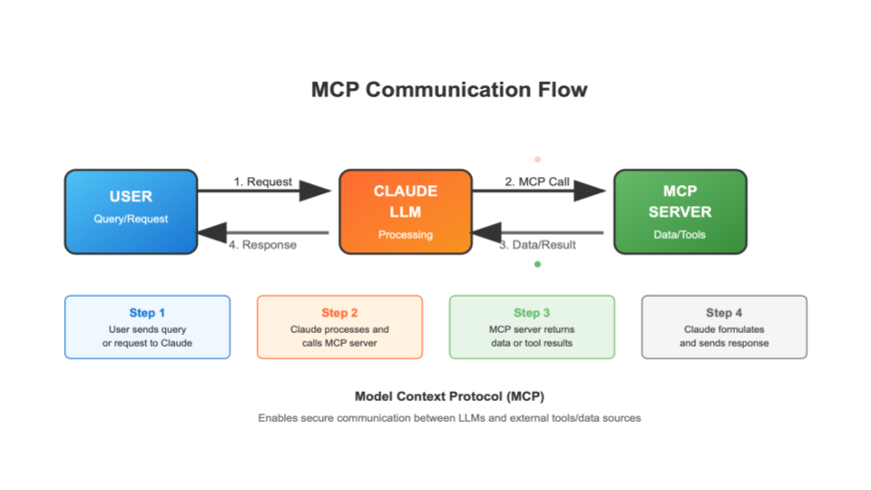

# CEFI MCP server

This repository provides the essential server components for working with the [Model Context Protocol (MCP)](https://modelcontextprotocol.io/docs/getting-started/intro). MCP enables you to build a personalized "agent" that leverages various large language models (LLMs) to process, analyze, and interact with external data. By creating MCP servers, you can create intelligent agents tailored to your specific requirements. Here, we build the CEFI MCP servers to serve as users' personal "CEFI AI agent" for various CEFI data queries, data analysis, and even creating interactive plots if the LLM client supports this capability.


The idea is to create topic- or event-specific MCP servers that focus on leveraging relevant external resources. These servers manage and return useful data or information to the LLM, enabling it to generate structured, resource-specific responses tailored to the user's needs.

## Installation
Installation steps may differ based on your MCP client or AI application (such as VS Code with copilet or Claude Desktop). Below, we outline the setup process for Claude Desktop using a local environment. With this approach, the MCP server runs on your local machine and depends on your internet connection. Support for remote server deployment is planned for future releases.

---
### Overview Setup Steps

1. [**Clone the repository**](#clone-the-repository)  
    Download the MCP server code to your local machine using `git clone`.

2. [**Install dependencies**](#install-dependencies)  
    Install `uv` and use it to set up the Python environment required for the MCP server.

3. [**Configure Claude Desktop**](#configure-claude-desktop)    
    Create and edit the Claude Desktop configuration file to register your MCP servers, then enable them in the Claude Desktop app.
---

### Clone the repository
For local setup, start by cloning this repository to your machine. In your preferred directory, run:
```bash
git clone git@github.com:NOAA-CEFI-Portal/cefi_data_mcp_server.git
```
---
### Install dependencies
After cloning the repository to your local directory, you'll need `uv`, an extremely fast Python package and project manager.

If `uv` is not already installed on your machine, follow the instructions below based on your operating system:

#### Mac/Linux
```bash
# Use curl
curl -LsSf https://astral.sh/uv/install.sh | sh
```

#### Windows
```powershell
# Install uv if not already installed
powershell -ExecutionPolicy ByPass -c "irm https://astral.sh/uv/install.ps1 | iex"
```


Once `uv` is installed, you can use `uv` set up the Python environment required to run the MCP server. 
```bash
# go to the repository
cd /ABSOLUTE/PATH/TO/PARENT/FOLDER/cefi_data_mcp_server/

# use uv to create the virtual environment based on the uv.lock file
uv sync

# activate the virtual env for testing the MCP function (optional)
source .venv/bin/activate

```
---
### Configure Claude Desktop
The [MCP page](https://modelcontextprotocol.io/quickstart/server#testing-your-server-with-claude-for-desktop) also has useful explanation and setup. Here, we summarize into the following steps.
1. Download latest version of Claude Desktop (https://claude.ai/download)
2. Create the Claude Desktop configuration file (any text editor. using vscode for demo)
    #### Mac/Linux
    ```bash
    code ~/Library/Application\ Support/Claude/claude_desktop_config.json
    ```
    #### Windows
    ```powershell
    code $env:AppData\Claude\claude_desktop_config.json
    ```

3. Copy Paste the following into configuration file
    #### Mac/Linux
    ```
    {
      "mcpServers": {
        "mcp_cefi_analysis": {
          "command": "uv",
          "args": [
            "--directory",
            "/ABSOLUTE/PATH/TO/PARENT/FOLDER/cefi_data_mcp_server",
            "run",
            "mcp_cefi_analysis.py"
          ]
        },
        "mcp_cefi_data_query": {
          "command": "uv",
          "args": [
            "--directory",
            "/ABSOLUTE/PATH/TO/PARENT/FOLDER/cefi_data_mcp_server",
            "run",
            "mcp_cefi_data_query.py"
          ]
        }
      }
    }
    ```
    #### Windows
    ```
    {
      "mcpServers": {
        "mcp_cefi_analysis": {
          "command": "uv",
          "args": [
            "--directory",
            "C:\\ABSOLUTE\\PATH\\TO\\PARENT\\FOLDER\\cefi_data_mcp_server",
            "run",
            "mcp_cefi_analysis.py"
          ]
        },
        "mcp_cefi_data_query": {
          "command": "uv",
          "args": [
            "--directory",
            "C:\\ABSOLUTE\\PATH\\TO\\PARENT\\FOLDER\\cefi_data_mcp_server",
            "run",
            "mcp_cefi_data_query.py"
          ]
        }
      }
    }
    ```

    >**!!!Caution!!!**
    >
    >For `"command": "uv"`, you may need to put the full path to the uv executable in the command field. You can get this by running `which uv` on macOS/Linux or `where uv` on Windows.
    

4. Enable the MCP server in the Claude Desktop
    
    Right under the input box where user can type the question and command, look for the search and tool button.
    One should be able to see the tools list with the disable radio button. If not shown, close the Claude Desktop App and reopen to see if it appear.
    

---
## CEFI AI Agent Demo
**Prompt** : "Can you show me the plot of the sea surface temperature forecast based on the newest nwatlantic forecast"

**Claude** :

